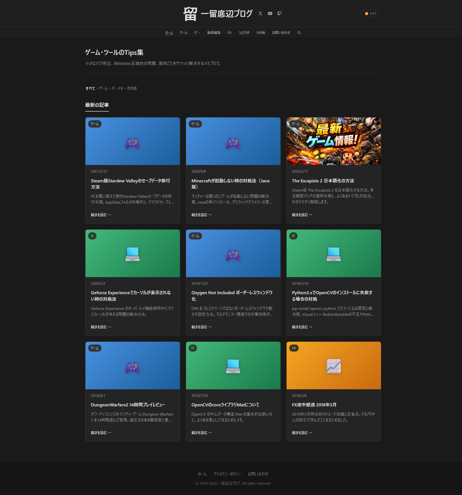

Chrome の標準機能だけで、スクロールが必要な長いページも含めてページ全体のスクリーンショットを撮る方法です。拡張機能は不要です。

## 手順

1. Chrome でスクリーンショットを撮りたいページを開く
2. **F12** キーで DevTools（開発者ツール）を開く
3. **Ctrl + Shift + P** でコマンドパレットを開く
4. `Capture full size screenshot` と入力して実行

これだけでページ全体の PNG 画像がダウンロードフォルダに保存されます。

実際にこの方法で撮影した当ブログのスクリーンショットがこちらです。スクロールしないと見えない部分も含めて、ページ全体が1枚の画像になっています。

## コマンドパレットで使える他のスクリーンショット系コマンド

コマンドパレットには他にもスクリーンショット関連のコマンドがあります。

| コマンド | 説明 |
|---------|------|
| `Capture full size screenshot` | ページ全体（スクロール含む） |
| `Capture screenshot` | 現在表示されている範囲のみ |
| `Capture node screenshot` | DevTools で選択中の要素だけ |
| `Capture area screenshot` | ドラッグで範囲を指定して撮影 |

## 用途の例

- 長いページを画像として保存したいとき
- AI ツール（Claude Code など）にページの内容を画像で渡したいとき
- Web ページのデザインを資料に貼りたいとき

## 注意点

- 非常に長いページだと画像サイズが大きくなります（数十MB になることも）
- 遅延読み込み（lazy loading）されるコンテンツは、先にスクロールして読み込ませてから撮影してください
- DevTools が開いた状態でスクリーンショットが撮られるため、DevTools のパネル部分は含まれません
