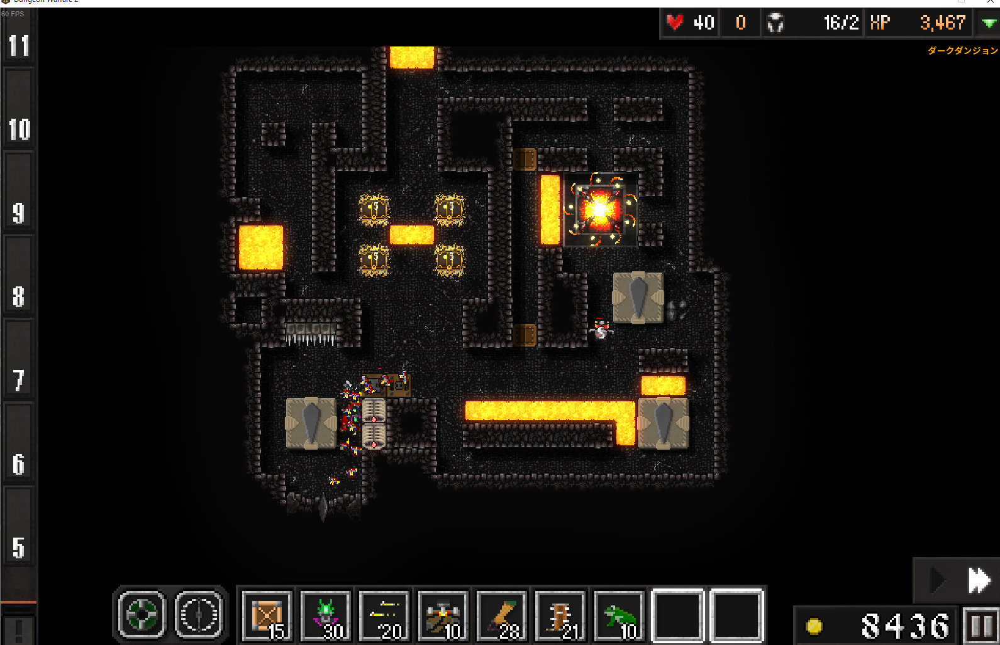
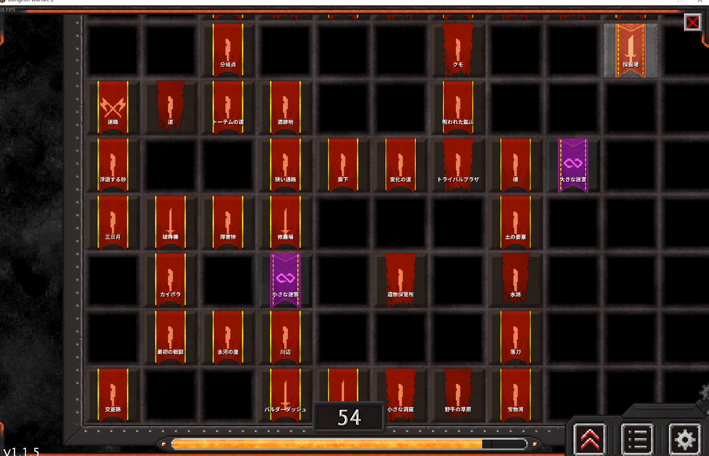
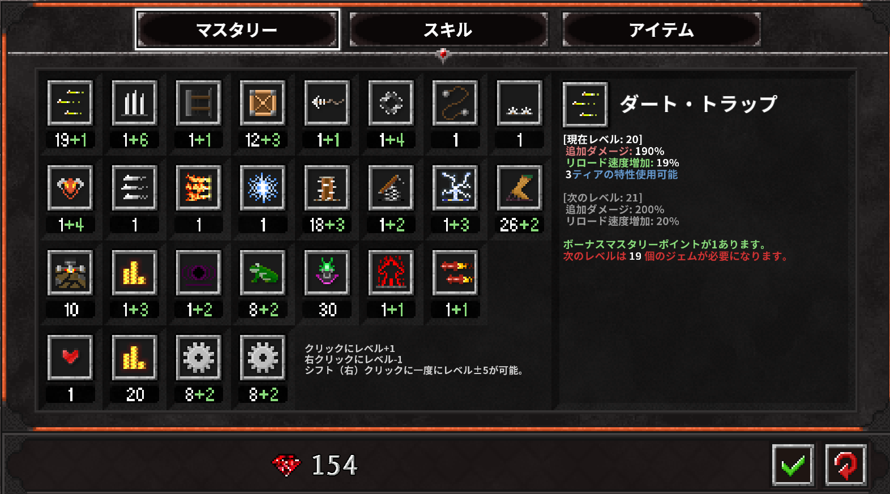
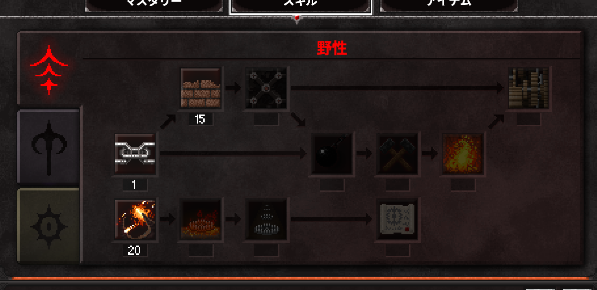
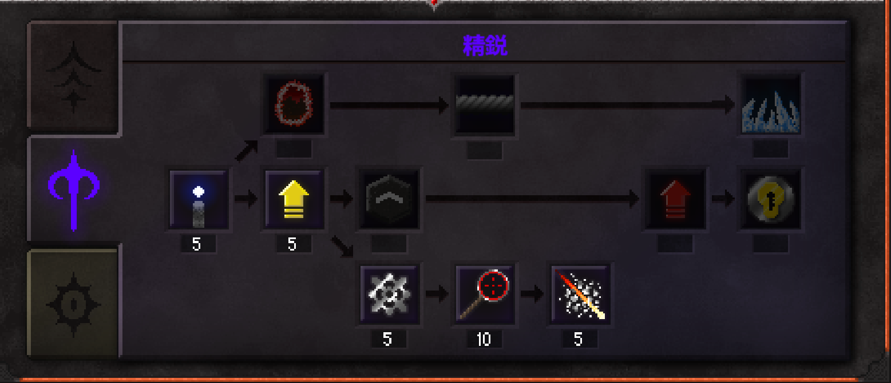
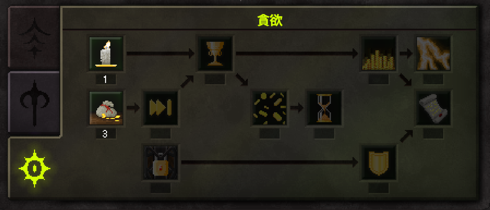
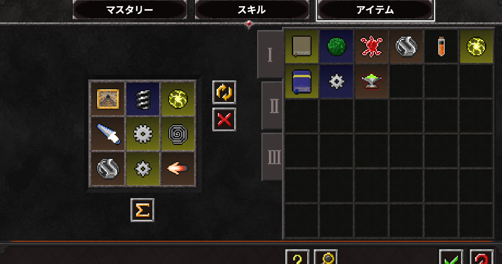

どうも、一留底辺です。

中盤から後半にかけて、ウェーブを重ねるごとに時間泥棒と化すタワーディフェンス系。
今回、Steam で人気の高い TD、**Dungeon Warfare 2** を買って14時間ほどプレイしてみました。

ぼくはプレイ日数1日、総プレイ時間14時間。
ようするに**1日で14時間このゲームを遊んでいた**ということです（快感）。

それでは解説とレビューしていきます。
ちなみにこの先ネタバレ要素があるので、プレイを検討していたりプレイし始めたばかりの方は
ネタバレを了承のうえ見てくださいね。

✅ この記事は<strong>2018年8月時点</strong>のプレイに基づくレビューです。価格やコンテンツは現在と異なる場合があります。

## ゲーム概要

- **タイトル**: Dungeon Warfare 2
- **ジャンル**: タワーディフェンス
- **価格**: ¥1,520（2018年8月・Steam 日本ストア時点）
- **プレイ人数**: シングルプレイヤー
- **実績**: あり

ストアページ: [Dungeon Warfare 2 — Steam](https://store.steampowered.com/app/698540/Dungeon_Warfare_2/)

## 14時間プレイしてみた感想

序盤は2〜6分ほどで1つのマップを攻略できてペースも良く、入りやすいスタートです。

ステージを進めていくと少しずつ難易度が上昇していき、敵の種類も増え、
攻略に必要なトラップも変わっていき、レベルを一定量上げる必要が出てくる箇所がちらほら出てきます。

しかし**レベル上げ特有のマンネリ感はありません**。
個性のあるスキルやトラップ、ルーンによる難易度の調整によって、
飽きずに、攻略できなかったステージもクリア圏内に持っていけます。

今のところ「絶対にクリアできないステージ」というのはなく、
レベル上げやスキル選び、トラップの設置に少し工夫をすれば、
多少適当にプレイしていても大丈夫、というのが印象です。

**結論**：ぼくは値段以上のクオリティだと感じたので、お友達に紹介したいゲームのひとつに追加しました。

## ゲームの特徴

このゲームの特徴として、以下のような要素があります。

- 個性豊かな**トラップ**
- ある条件下にて**突然生成されるステージ**
- 経験値システムによるパッシブスキルの強化や強化スキルなどの**成長要素**
- エンドレスモードならぬ**無限モード**
- トラップのステータスを上昇させる**装備システム**
- 自身を追い込むマゾ・玄人向けの**難易度上昇ルーンシステム**

これから順に紹介していきます。

## ステージ選択画面

この画面でステージを選択します。
右下の上昇マークみたいなのがスキル・アイテム・ビルド等の設定を行うところで、
その右のアイコンがマップ一覧、次の歯車マークが設定画面です。

## マスタリー

マスタリーは、プレイヤーレベルが上がったり条件をクリアしたりして手に入れた**ジェム**を消費して、
トラップのレベルを上げてダメージを上げたりするところです。

トラップは下の図のようにたくさんあることがわかりますよね。これだけあれば飽きません。

## スキル

スキルの種類は3種類あって、**野性・精鋭・貪欲**の3つからなります。

### 野性

野性は、トラップの基礎能力やポータル（陣地）を守護するスキルがあったりします。

### 精鋭

精鋭は、トラップの特殊効果（貫通効果など）の強化部分にあたります。

### 貪欲

貪欲はお金のスキルです。敵を10体倒すたびにゴールドが手に入ったりするスキルがあります。

## アイテム

アイテムは装備アイテムにあたるところです。**最大9コマ**で装備できます。

特定のトラップの攻撃頻度や範囲を上げたり、マップのギミックの効果を変更したり、
初期ゴールドの量を増やしたりと、様々なアイテムがあります。

## まとめ

基本的な部分はこれでおしまいです。実績等もあるから飽きさせませんね。

タワーディフェンス系のゲームを始めちゃうとやめられません。
Steam なら Dungeon Defenders もオススメです。
