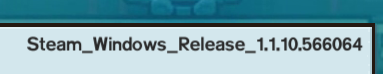
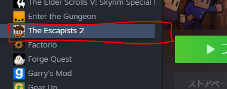
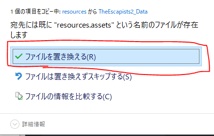
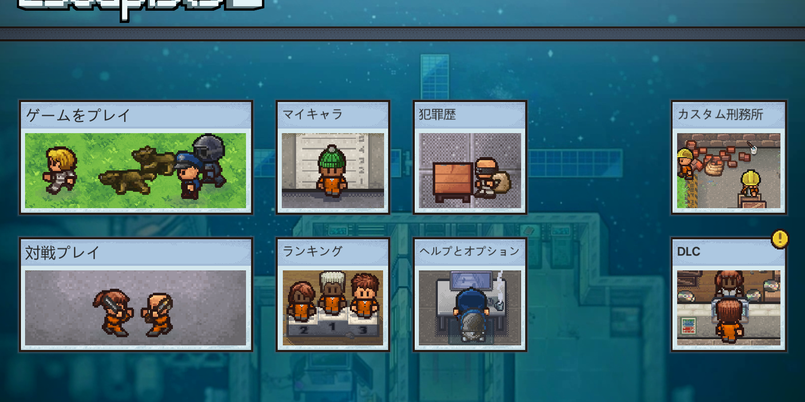
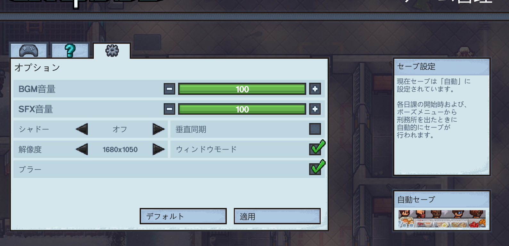

Steam で購入した **The Escapists 2** は残念ながら公式の日本語対応がありません。
しかし有志による日本語化用の翻訳ファイルが公開されており、これを適用することで日本語でプレイすることができます。
この記事では、翻訳ファイルの入手から適用までの手順を解説します。

<div class="note-box">
✅ この記事の初出は2020年2月ですが、翻訳ファイルの入手先と適用手順は2022年10月8日時点の情報へ更新しています。掲載している説明画像は当時の画面例のため、現在の Steam やゲーム画面とは表示が異なる場合があります。ゲームのアップデートによって手順が変わる場合があります。
</div>

## 必要なもの

- Steam 版 The Escapists 2（バージョン確認推奨）
- 有志翻訳ファイル（後述のリンクから入手）
- 7-Zip などのアーカイブ解凍ソフト

## 手順1: ゲームのバージョンを確認する

翻訳ファイルは対応バージョンが分かれていることがあるため、まず自分のバージョンを確認します。

Steam から The Escapists 2 を起動し、最初の画面で **HELP & OPTION** を開きます。
画面の中央右あたりに `Steam_Windows_Release_〇〇` と書かれているところがあり、これがバージョンです。



※画像は2020年2月に確認したときのバージョンです。使用する翻訳ファイルは、GitHub Release に記載された対応バージョンに合わせてください。

## 手順2: 翻訳ファイルを入手する

有志翻訳プロジェクトの GitHub Releases から翻訳ファイルをダウンロードします。
現在は [TheEscapist2_JALocalizedFiles の MajorUpdate リリース](https://github.com/hatosableSAN/TheEscapist2_JALocalizedFiles/releases/tag/MajorUpdate) で配布されています。
このリリースは Version 1.10.666175 向けで、2022年10月8日時点のゲームバージョンに対応しています。

> ダウンロードしたファイルは必ずウイルススキャンをかけてから使用してください。
> 信頼できるソースからのみダウンロードすることを強く推奨します。

## 手順3: 翻訳ファイルを適用する

ダウンロードした zip ファイルを解凍すると、以下のようなファイルが含まれています。
Windows の場合は、自分の環境に合った `Resourse_〇〇.zip` を使用してください。

```
Resourse_〇〇/
  ├── resources.assets
  └── Unity_Assets_Files/
```

ゲームのインストールフォルダは、Steam ライブラリで The Escapists 2 を右クリック →「プロパティ」→「ローカルファイル」→「ローカルファイルを閲覧」で開けます。



※現在の Steam では「ローカルファイル」タブの名称が「インストール済みファイル」に変わっています。

開いたフォルダ内の `TheEscapists2_Data` フォルダを開き、
既存の `resources.assets` をダウンロードした翻訳ファイル側の `resources.assets` に置き換えます。
同じ場所に `Unity_Assets_Files` も配置してください。
上書き前に、既存の `resources.assets` はバックアップしておくのをおすすめします。



## 手順4: 日本語表示を確認する

ゲームを起動し、タイトル画面やメニューが日本語で表示されていれば適用完了です。
反映されない場合は、`resources.assets` の置き換え先と `Unity_Assets_Files` の配置場所を確認してください。





## 日本語化後に起こりやすいトラブルと対処法

### 文字化けが発生する場合

フォントファイルが正しく配置されていない可能性があります。
翻訳ファイル内に `Font/` フォルダが含まれている場合は、
そちらも同様にコピーしてください。

### 一部テキストが英語のまま

翻訳が未完成の部分や、DLC コンテンツは英語のままになることがあります。
翻訳プロジェクトの更新を定期的にチェックしてみましょう。

### ゲームがクラッシュする

ゲームのバージョンと翻訳ファイルのバージョンが一致していない可能性があります。
Steam の「プロパティ」→「アップデート」から自動更新の設定を確認し、
ゲームバージョンに対応した翻訳ファイルを使用してください。

## まとめ

The Escapists 2 の日本語化は決して難しくありませんが、バージョン管理が鍵です。
ゲームが更新されるたびに翻訳ファイルとの互換性を確認するようにしましょう。
有志の翻訳者さんたちに感謝しつつ、日本語でたっぷり楽しんでください！
