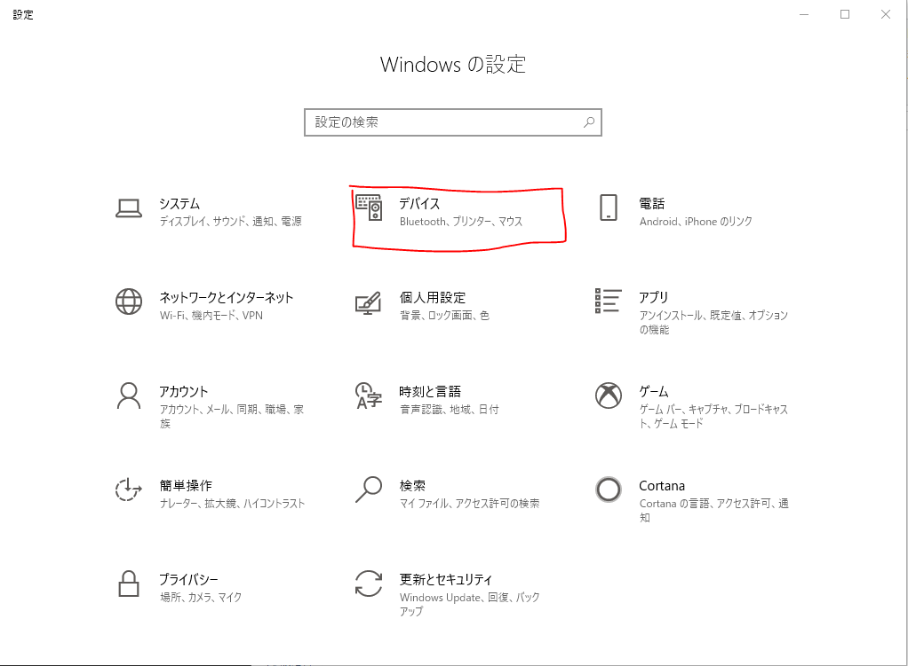
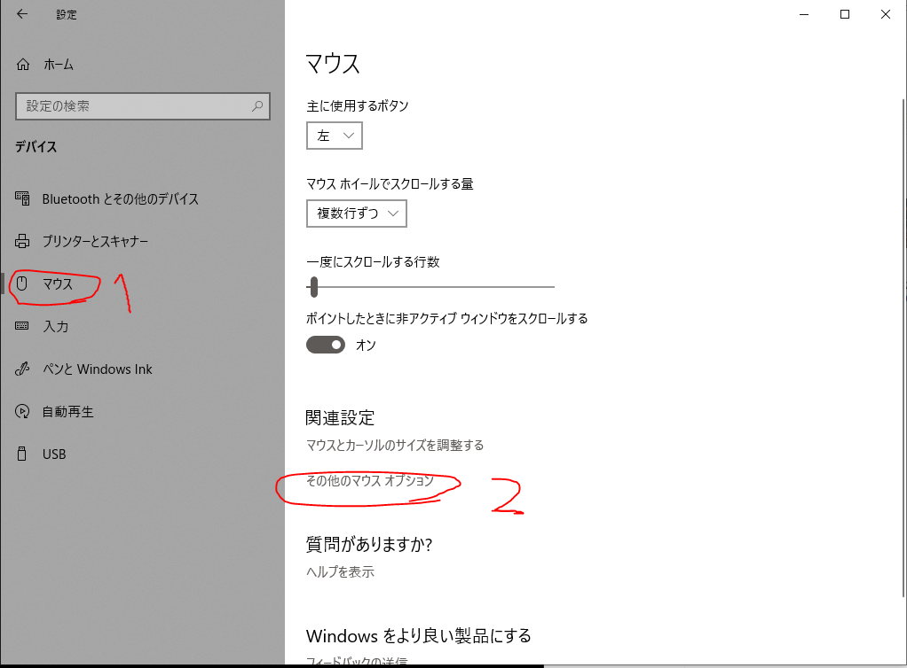
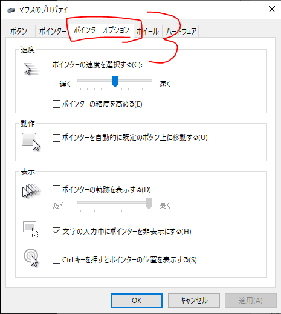
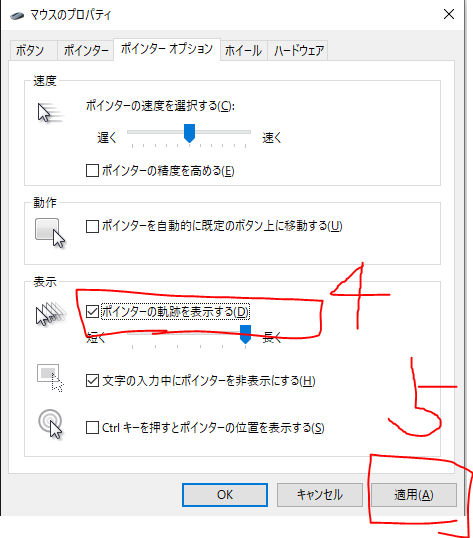
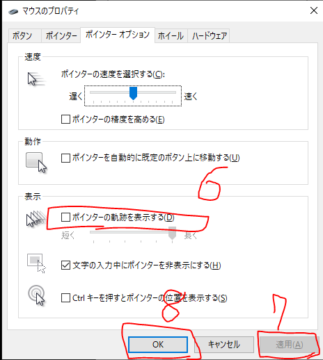

Geforce Experience でゲームを録画したところ、できあがった動画に**マウスカーソルだけが映っていない**ということがありました。
プレイ中の画面ではきちんと見えているのに、録画された映像ではカーソルが消えています。

原因がわからず厄介でしたが、**Windows 側のマウス設定を触ることで解消**できました。
NVIDIA 側ではなく OS 側の設定だった、というのがポイントです（Windows 10 で確認）。

## マウス設定をやり直す

### 1. マウスのプロパティを開く

「設定」→「デバイス」を開きます。

左のメニューから **①マウス** を選び、関連設定にある **②その他のマウス オプション** をクリックします。

### 2. ポインター オプションタブへ移動する

「マウスのプロパティ」が開くので、**③ポインター オプション** タブをクリックします。

### 3. 「ポインターの軌跡を表示する」を一度オンにする

表示の欄にある **④ポインターの軌跡を表示する** にチェックを入れ、**⑤適用** を押します。

### 4. チェックを外して確定する

適用したら、**⑥ポインターの軌跡を表示する** のチェックを**外して**、**⑦適用** → **⑧OK** の順に押します。

軌跡表示は一度オンにして適用するだけで、オンのままにしておく必要はありません。
設定をオン・オフと往復させることに意味があります。

## 録画して確認する

設定後にもう一度 Geforce Experience で録画してみると、カーソルがきちんと映るようになりました。

なぜこの操作で直るのかまでは、正直なところ分かっていません。
ただ NVIDIA 側の設定を一切変えずに解決したので、同じ症状で困っている場合は最初に試してみる価値があります。

📝 この記事は2020年2月にWindows 10で確認した内容です。 
・Windows 11 では「設定」→「Bluetooth とデバイス」→「マウス」→「マウスの追加設定」から同じ「マウスのプロパティ」を開けます。 
・Geforce Experience 自体は、2024年11月12日に正式リリースされた <strong>NVIDIA App</strong> へ置き換えられ、ShadowPlay などの機能はそちらへ移行しています。録画機能の入り口は変わりましたが、上記はWindows側の設定なので操作は同じです。

