今回は Windows 10、Visual Studio 2015（C++）環境に **OpenCV 3.4.1** を導入し、
基本的な動作が確認できるまでの作業を行います。

<div class="note-box">
✅ この記事は<strong>2018年6月・OpenCV 3.4.1 / Visual Studio 2015</strong> 時点の手順です。現在は OpenCV 4.x が主流で、パス内の <code>vc14</code> や lib のファイル名が変わります。読み替えのポイントは記事末にまとめました。
</div>

## OpenCV 3.4.1 をダウンロードする

OpenCV 公式サイトのリリースページを開き、下図の **Win pack** をクリックします。


少し待つと、下図のように5秒後に自動でダウンロードが始まります。


`opencv-3.4.1-vc14_vc15.exe` という約171MB の exe ファイルがダウンロードされたはずです。

`opencv-3.4.1-vc14_vc15.exe` を起動して、展開先を選んで **Extract** をクリックすると、
自動でファイルが生成されます。ちなみにぼくは `C:\` 直下（ローカルディスク）に作りました。

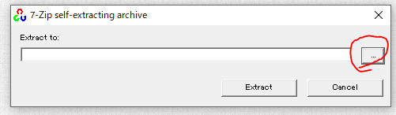

生成が終わったら opencv のフォルダを確認します。下図のようになっていれば OK です。

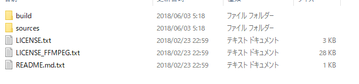

## 環境変数の編集

次に環境変数の編集を行います。

スタートボタンの横の検索から「**環境変数**」と入力して検索し、
最も一致する検索結果から出た「**環境変数を編集**」を起動します。

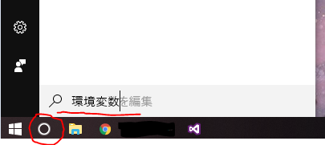


開いたら、ユーザー環境変数の中にある「**Path**」を選択して「編集」を押します。

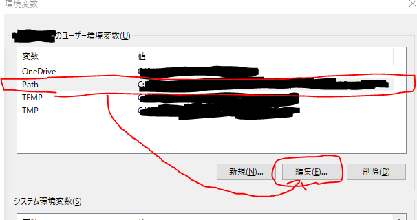

環境変数名の編集画面が出てくるので「新規」を押し、
生成した opencv フォルダの中にある **build フォルダのパス**をここに追加します。

ぼくの場合は `C:\` 直下に生成したので `C:\opencv\build\x64\vc14\bin` になります。
入力したら OK ボタンを押して完了です。

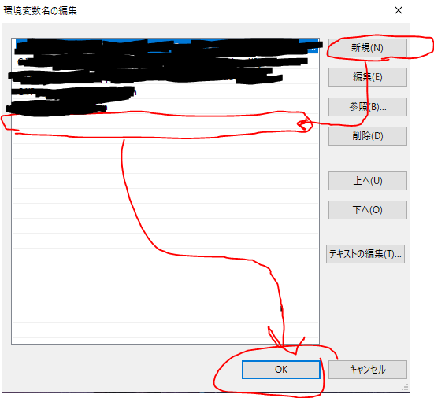

## Visual Studio 2015（64bit）で参照ファイルの設定

Visual Studio 2015 を起動 → 新規作成 → プロジェクト → テンプレートは
Visual C++ の **Win32 コンソールアプリケーション**を選択します。

名前は適当で OK（ここでは `ConsoleApplication1` にしました）。
「次へ」を押して、追加のオプションの「**空のプロジェクト**」にチェックを入れて「完了」。

下図のように赤枠部分を変更します。

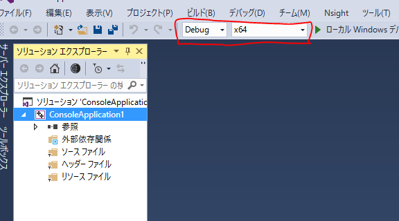

次にソリューションエクスプローラー内にある `ConsoleApplication1` を右クリックしてプロパティを開きます。

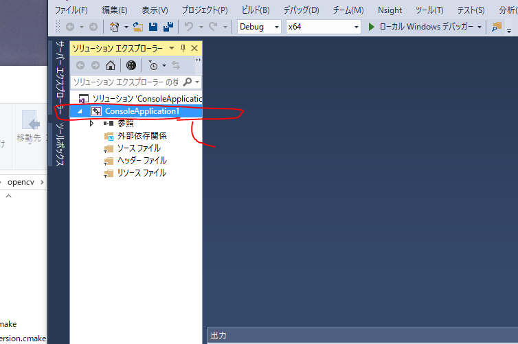

ここで一番重要な、参照する**インクルードディレクトリ**と**ライブラリディレクトリ**を編集して、
**リンカーの入力に追加のライブラリ**を入れます。

とりあえず構成を「すべての構成」にして、プラットフォームは **x64** にしておきます。
下線のついているところが編集する3点です。

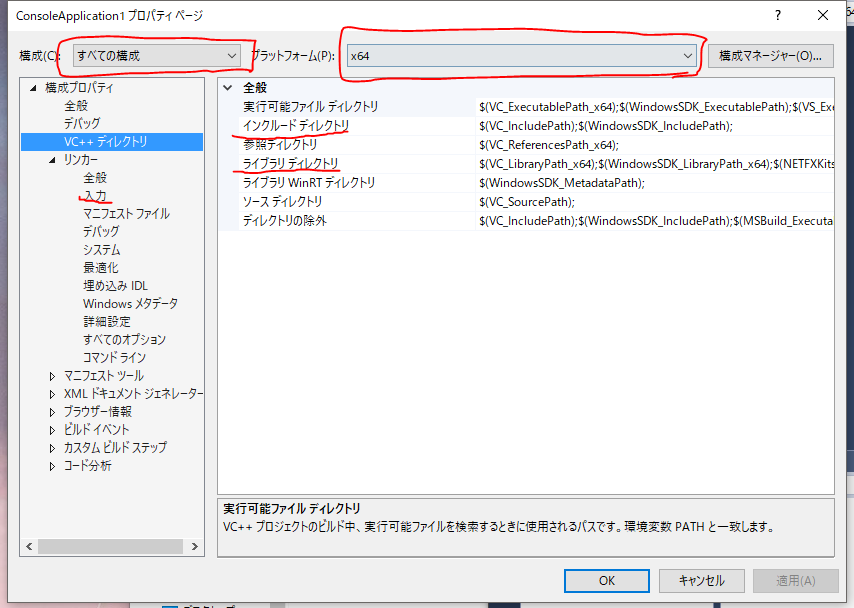

### インクルードディレクトリ

まずはインクルードディレクトリを編集します。

下図のように VC++ ディレクトリ内のインクルードディレクトリをクリックすると右側に「∨」マークが出るので、
それをクリックして「編集」を押します。

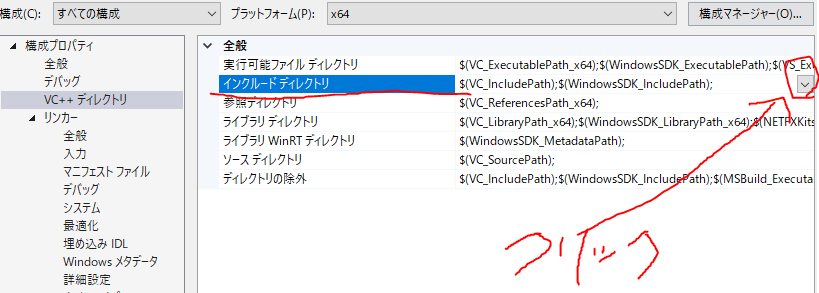

下図のようなウィンドウが出るので、空白の欄をクリックして右に出る「...」をクリックすると、
参照するファイルを選択できます。

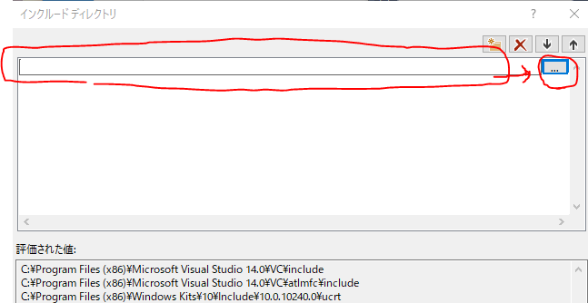

opencv のインクルードフォルダを選択します。
ぼくの場合は `C:\` 直下なので `C:\opencv\build\include` となります。

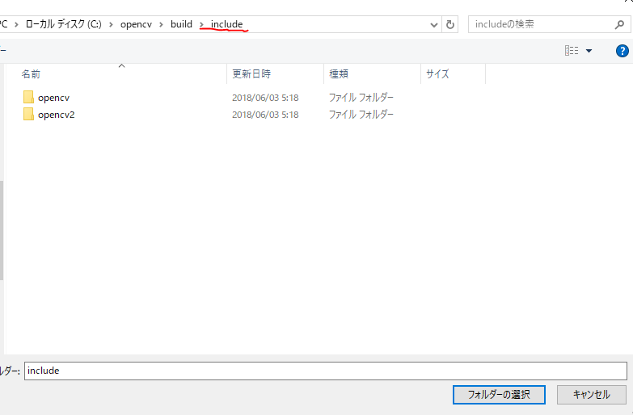

### ライブラリディレクトリ

入力をしたら OK を押して、次はライブラリディレクトリを編集します。

今行った作業と同じように、VC++ ディレクトリ内のライブラリディレクトリをクリックして、
右に出る「∨」を押して「編集」を押します。

ぼくの場合は `C:\` 直下なので `C:\opencv\build\x64\vc14\lib` になります。

> ちなみに **x64** は 64bit のこと、**vc14** は Visual Studio 2015 のことです。

入力を終えたら下図のようになるはずです。そうしたら、とりあえず「適用」を押しておきます。

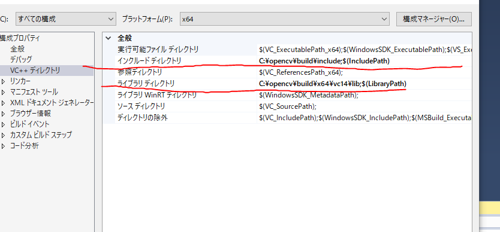

### リンカーの設定

最後にリンカーの設定です。

構成を **Debug** に変更して、プラットフォームが x64 であることを確認し、
「リンカー」→「入力」→「**追加の依存ファイル**」の編集を行います。

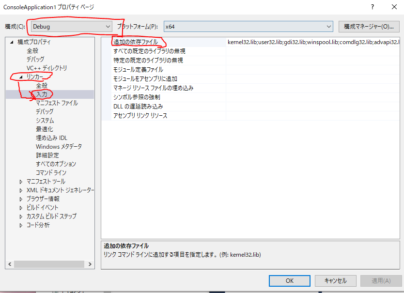

ここではファイル参照ボタンがないので、直接入力して OK します。

今編集している構成は Debug なので、opencv の lib にある **`opencv_world341d.lib`** を入力します。
場所はぼくの場合 `C:\opencv\build\x64\vc14\lib` にあります。
入力すると「評価された値」に表示されるのでわかります。

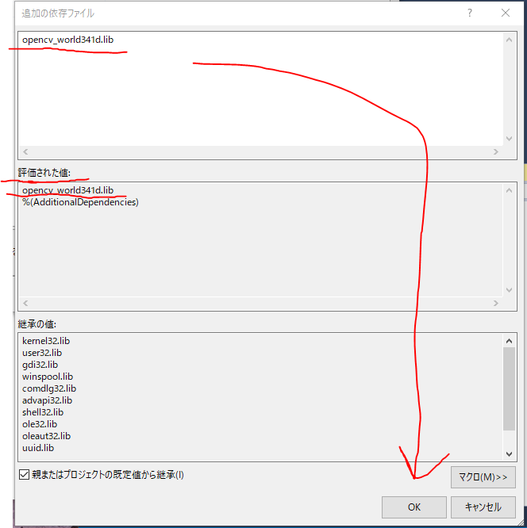

次に構成を **Release** に変更してプラットフォームが x64 であることを確認し、
同じく「リンカー」→「入力」→「追加の依存ファイル」→「編集」。

ここには Release 用のライブラリを入力します。
Debug のときは `opencv_world341d.lib` でしたが、**「d」がついていないほう**を入力します。
ぼくの場合は `opencv_world341.lib` です。

できたら OK を押して、適用と OK を押して保存し、
Visual Studio 2015 を再起動して設定したプロジェクトを起動します。これで設定は終わりです。

## 簡単なテスト

OpenCV のライブラリがちゃんと動作するか確認します。

cpp ファイルの作成は、ソリューションエクスプローラーの `ConsoleApplication1` を右クリックして
→ 追加 → 新しい項目 → Visual C++ の C++ ファイル（cpp）を選択して追加します
（名前は適当。ここでは `Source.cpp` にしました）。

テスト用のソースコードです。

```cpp
#include <opencv2/opencv.hpp>

int main(void)
{
    cv::Mat img(cv::Size(100, 100), CV_8UC3, cv::Scalar(255, 0, 0));
    cv::imshow("img", img);

    cv::waitKey();

    return 0;
}
```

書き終えたら `Ctrl` + `F5` でデバッグなしで開始。
下図のような結果になれば導入完了です。おめでとうございます。

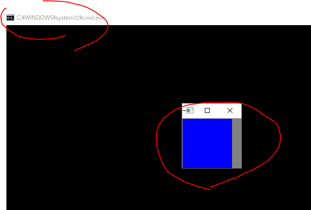

色のついているウィンドウ上で適当なキーを押すと終了します。

## 現在のバージョンで読み替えるポイント

OpenCV 4.x / 新しい Visual Studio を使う場合は、以下を読み替えてください。

| 項目 | 本記事（3.4.1 / VS2015） | 現在 |
|---|---|---|
| ダウンロード元 | `opencv.org/releases.html` | [opencv.org/releases](https://opencv.org/releases/) |
| bin のパス | `build\x64\vc14\bin` | `build\x64\vc16\bin`（VS2019 以降のビルド） |
| lib のパス | `build\x64\vc14\lib` | `build\x64\vc16\lib` |
| lib のファイル名 | `opencv_world341.lib` / `...341d.lib` | `opencv_world4xx.lib` / `...4xxd.lib`（例: 4.10 なら `opencv_world4100.lib`） |
| プロジェクトテンプレート | Win32 コンソールアプリケーション | Windows デスクトップウィザード → コンソールアプリケーション |

`vcXX` の部分は展開した `build\x64\` の中にあるフォルダ名を実際に見て合わせるのが確実です。
また、`cvScalar` などの古い C 言語 API は OpenCV 4 で削除されているため、
`cv::Scalar` を使ってください（本記事のテストコードは修正済みです）。

公式ドキュメントは英語ですが、[OpenCV Documentation](https://docs.opencv.org/) に
すべての情報が書いてあります。
