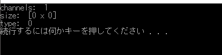
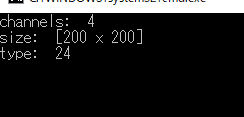
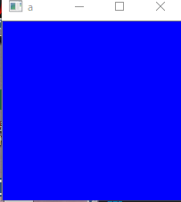

OpenCV を用いた画像処理において、知らないといけない `cv::Mat` についてちょっと調べてみました。

ぼくの PC 環境は以下のようになっています。

- Visual Studio 2015 64bit
- OpenCV 3.4.1
- OS: Windows 10 64bit Pro
- CPU: i7 7700K
- RAM: 16GB
- GPU: GTX 1060 6G

<div class="note-box">
✅ この記事の初出は2018年7月、OpenCV 3.4.1 時点の内容です。OpenCV 4 以降で書き方が変わった箇所は本文中で補足しています。
</div>

## cv::Mat の画像データの扱いについて

OpenCV 環境下で画像データを扱うには、まず欠かせない `Mat` を見ていきます。

`Mat` は**チャンネル・サイズ・タイプ**の3つから構成されています。
この3つのデータを変えて、出力される画像を拡大・縮小・変形したり、座標データを取得したり、
データを書き込んだり……いろいろな API や関数を組み合わせることによって出来上がるのが処理結果なのです。

とりあえず、下のソースコードをコピペして起動してみましょう。

```cpp
#include <opencv2/core.hpp>
#include <iostream>

int main() {
    cv::Mat a;
    std::cout << "channels: " << a.channels() << std::endl;
    std::cout << "size: "     << a.size()     << std::endl;
    std::cout << "type: "     << a.type()     << std::endl;

    return 0;
}
```

### コードの解説

`#include <opencv2/core.hpp>` では、名前の通り OpenCV2 ファイル内にある `core.hpp` を取り込んでいます。
core の中身は主に**画像や行列のデータ構造の提供**をしています。
他には配列の操作に用いるものや、ユーザーの操作を楽にさせるためのユーティリティ等々が入っています。

`#include <iostream>` は C++ を扱っている人は知っていると思いますが、C++ の標準ライブラリです。

次に `Mat` についてです。
OpenCV の関数を呼び出すときは、最初に `cv::` を入れることを忘れないでください。
ちなみに省略することもできます。`using namespace cv;` を include 行の下あたり（`main` の外）に入れておくことで、
`cv::Mat` ではなく `Mat` と入れるだけで呼べます。

`a.channels()` / `a.size()` / `a.type()` の部分は、`Mat` のインスタンスの中身を見るために呼び出しています。
さきほどのサンプルコードを走らせたら、下のような結果が出ると思います。



- **channel（scalar）** = 色の数
- **size** = 画像の大きさ
- **type** = バイト数（データ型）

このように、OpenCV では3つの要素から構成されています。下で詳しく解説します。

## チャンネルとは

主に**色を表現するために扱われる部分**です。

チャンネルが1の状態だと、白から黒までの情報を扱うような感じになります。
1チャンネルの符号なし8ビット長だと 0〜255 までの数値で白から黒までの輝度を表現できます。
ようするに**グレースケール（白黒画像）**ということです。

そして3チャンネルになると、**RGB（レッド・グリーン・ブルー）**を表現方法として扱えるようになります。

## サイズとは

**画像の大きさ**と考えていいです。
「〜キロバイト」とかそういう意味ではなく、画像の大きさ、ドット部分の占有数的なことです。

例えば 100×100 だと、そのピクセル数を持ったデータということです。
このピクセルひとつひとつに RGB データが入っています。

## タイプとは

C++ でいうところの**データ型**です。
`unsigned char` 型ならば `CV_8U` と指定します（OpenCV で指定されている数字でも可）。
ここで1つのピクセルに何バイト使うか決まります。

よく使う型は以下の通りです。

| 型 | 意味 |
|---|---|
| `CV_8UC1` | 8bit 符号なし整数・1チャンネル（グレースケール） |
| `CV_8UC3` | 8bit 符号なし整数・3チャンネル（BGR） |
| `CV_8UC4` | 8bit 符号なし整数・4チャンネル（BGR + 透過） |
| `CV_32FC1` | 32bit 浮動小数点・1チャンネル |

## サイズを指定して Mat を生成する

さっきは `Mat a` だけで生成しましたが、次は**データの大きさを指定して生成**します。
下のコードをコピペして起動してみてください。

```cpp
#include <opencv2/core.hpp>
#include <opencv2/highgui.hpp>
#include <iostream>

int main() {
    cv::Mat a(200, 200, CV_8UC4, cv::Scalar(255, 0, 0));
    std::cout << "channels: " << a.channels() << std::endl;
    std::cout << "size: "     << a.size()     << std::endl;
    std::cout << "type: "     << a.type()     << std::endl;

    cv::imshow("a", a);
    cv::waitKey();

    return 0;
}
```

> **OpenCV 4 以降での注意**：初出時は `cvScalar(255, 0, 0)` と書いていましたが、
> この C 言語時代の API は OpenCV 4 で削除されました。現在は上のように **`cv::Scalar`** を使ってください。

今回は `a` に対して 200×200 の大きさを与えてタイプを `CV_8UC4` にし、色部分に **B に 255** を与えました。

一番左が 255 なので R と間違えてしまいがちですが、**OpenCV では BGR の順**です。
ここ面倒くさいですよね。でも間違えないようにしないと、色がぐちゃぐちゃになってしまいます。

結果はどうでしょう。小さい**青いウィンドウ**が出てきたと思います。
処理を終了させるには、ウィンドウをアクティブ状態にして何かしらのキーを押します。

重要な部分はこれです。

```cpp
cv::Mat a(200, 200, CV_8UC4, cv::Scalar(255, 0, 0));
```

`200, 200` で大きさを指定、`CV_8UC4` でタイプを指定、`cv::Scalar()` で色を指定しています。

### 処理結果

コンソール画面：



`cv::imshow` での画像データ表示：



コンソール画面では**4チャンネル**でサイズ `[200 x 200]`、`type` が **24** になっていますね。

4チャンネルということは、BGR に加えて**透明度（透過）**を表しているので4チャンネルになります。
サイズは imshow での画像データ表示結果のウィンドウの大きさのことです。

そして `type` が 24 というのは、OpenCV のライブラリ内であらかじめ決められた構造を呼び出しています。
ようするに **24番目が `CV_8UC4`** ということです。これは符号なし（マイナスなし）のチャンネル4つを表しています。

## cv::imshow と cv::waitKey とは

最後の部分に出てきた `cv::imshow` と `cv::waitKey` について。

まず、これだけは押さえておいてほしいのは、**この二つはニコイチで扱うことを前提としている**ことです。

`cv::imshow("a", a);` の `"a"` ではウィンドウの名前を決めています。
試しにここを変えて起動してみると、ウィンドウの名前が変更されていると思います。
そのあとに記述されている `a` は、表示する画像の引数を表しています。

`waitKey` は**キー入力を待つ関数**であるとともに、**OpenCV のウィンドウ部の更新をする機能**も持っています。

つまり `imshow` でウィンドウを呼び出したとしても、更新機能のない `imshow` だけでは
再描画されずにエラーを吐いてしまったり、画像同士を重ね合わせる場合に変な動作を引き起こしてしまったり、
サイズ変更やウィンドウの移動を行う際に処理がずれていってしまう可能性があるわけです。

ようするに、この二つはニコイチとして扱うと思っておいたほうがいいです。

## おまけ：Mat のコピーは参照になる

`Mat` を触り始めてから気づいた最大の罠がここです。

```cpp
cv::Mat a = cv::imread("photo.jpg");
cv::Mat b = a;  // シャローコピー！同じデータを参照している

b.at<cv::Vec3b>(0, 0) = {255, 0, 0};  // a も変わってしまう
```

`=` での代入は**参照カウントによるシャローコピー**になります。
独立したコピーが必要な場合は、必ず `clone()`（または `copyTo()`）を使いましょう。

```cpp
cv::Mat c = a.clone();   // ディープコピー
```

画像の一部を切り出す ROI（Region of Interest）も同様に参照になります。

```cpp
cv::Rect roi(100, 100, 200, 200);
cv::Mat region = a(roi);              // これも参照
cv::Mat region_copy = a(roi).clone(); // 独立させるなら clone
```

## まとめ

- `Mat` は**チャンネル・サイズ・タイプ**の3要素で構成される
- 色の順序は **BGR**（RGB ではない）
- `imshow` と `waitKey` はニコイチで使う
- `Mat` の代入も ROI 抽出も**参照**。独立したコピーは `clone()`

RGB と BGR がこんがらがりますね。
CUDA API を使うとコピー処理の記述が逆だったりして、もっとわからなくなります。
