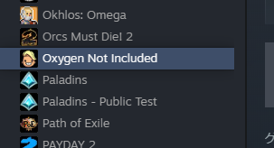
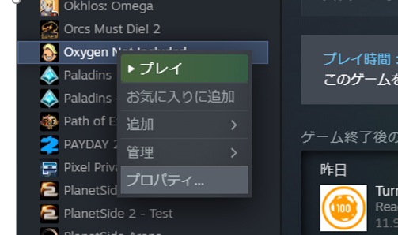
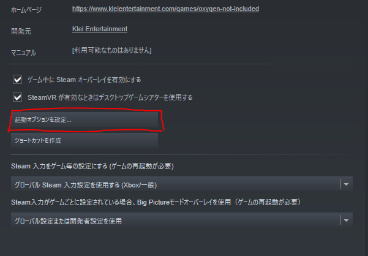
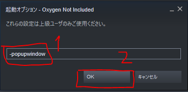
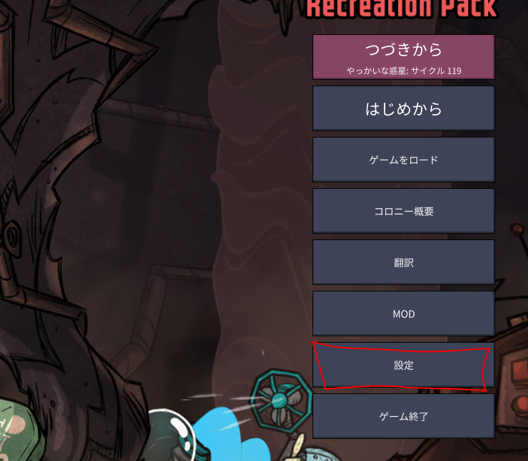
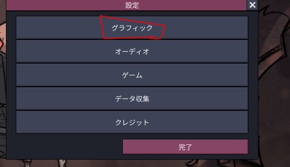
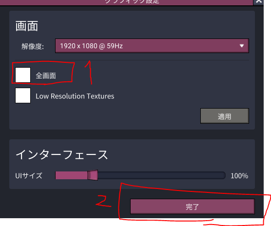
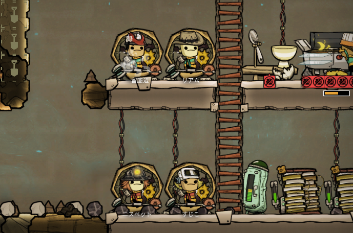

Oxygen Not Included（ONI）を全画面でプレイしていると、マルチディスプレイ環境では画面を切り替えるたびにクライアントが裏に飛んでしまいます。
ボーダーレスウィンドウにすればこれが解消され、別モニターで攻略情報を見ながら遊べるようになります。

この記事では、Steam の起動オプションを使ってボーダーレスウィンドウ化する手順を紹介します。
※ゲームの言語は日本語設定で説明します。

ℹ️ ONI のグラフィック設定に「ボーダーレス」という項目はありません。<a href="https://forums.kleientertainment.com/forums/topic/87688-is-there-any-way-to-make-the-game-borderless/">Klei公式フォーラムでの回答</a>でも、Unity製であるためグラフィックオプションへの追加は難しいと説明されています。そのため下記のように<strong>起動オプション側で指定する</strong>のが実質的な方法になります。

## 1. Oxygen Not Included のプロパティを開く

Steam を開き、ライブラリの Oxygen Not Included を右クリックして「プロパティ」を選びます。

## 2. 起動オプションを設定する

プロパティ画面にある「起動オプションを設定...」をクリックします。

入力欄に **①`-popupwindow`** と入力し、**②OK** を押します。

📝 掲載画像は2019年当時のSteamの画面です。現在のSteamでは「起動オプションを設定...」ボタンは無くなり、プロパティの「一般」タブに「起動オプション」の入力欄が直接置かれています。入力する内容は同じです。

## 3. ゲーム内の全画面設定を外す

起動オプションを入れたら Oxygen Not Included を起動し、メインメニューから「設定」を開きます。

設定メニューの「グラフィック」を開きます。

画面の欄にある **①全画面** のチェックを外し（すでに外れていればそのまま）、**②完了** を押します。

## 完了

これでボーダーレスウィンドウで起動するようになります。
画面を切り替えてもクライアントが裏に飛ばなくなり、マルチディスプレイでの操作が快適になります。

## 補足: 解像度について

ボーダーレスウィンドウではデスクトップの解像度に合わせて表示されます。
高解像度モニターでUIが小さく感じる場合は、同じグラフィック設定内にある「インターフェース」のUIサイズで調整できます。
