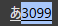

PCで「あ゙」や「濁゙点゙な゙ん゙よ゙」のように、普通は濁点がつかない文字へ濁点をつける方法を紹介します。

やり方は、Windowsの日本語入力で文字の後ろに `3099` と入力し、Spaceキーで`3099`を選択してから **F5キー**を押すだけです。

## PCで文字に濁点をつける手順

例として「あ」に濁点をつけて「あ゙」と入力します。

1. 日本語入力をオンにして「あ」と入力する
2. 続けて `3099` と入力する
3. **Spaceキー**を押す。ただし、Enterキーでは確定しない
4. `3099`の部分にフォーカスを合わせる
5. 画像のように`3099`が選択された状態で **F5キー**を押す

入力途中は「あ３０９９」のように表示されます。

*「あ」に続けて3099と入力。まだ確定しません。*

Spaceキーを押したあと、確定せずに`3099`へフォーカスを合わせます。

*`3099`が選択されたこの状態でF5キーを押します。*

F5キーを押すと、`3099`が濁点に変換されて「あ゙」になります。

*F5キーを押すと「あ゙」に変換されます。*

## 複数の文字につける

濁点をつけたい文字ごとに、同じ操作を繰り返します。

*それぞれの文字に濁点をつけた例*

たとえば、次のような文字も入力できます。

> 濁゙点゙な゙ん゙よ゙

> ゆ゙る゙じでぇ゙ぇ゙ぇ゙ぇ゙ぇ゙ぇ゙

## うまくいかないとき

- Spaceキーを押したあと、Enterキーで確定せず、`3099`にフォーカスが合った状態でF5キーを押してください。
- ノートPCでは、機種によって **Fn + F5** を押す必要があります。
- アプリやフォントによっては、濁点の位置がずれたり正しく表示されなかったりします。
- F5でページが再読み込みされる場合は、日本語入力がオンで、`3099`が選択された変換中の状態になっているか確認してください。

## 仕組み

`3099` は、Unicodeの「結合用濁点（COMBINING KATAKANA-HIRAGANA VOICED SOUND MARK）」のコードです。F5キーでUnicodeコードから文字へ変換し、直前の文字と組み合わせて表示しています。

普段は濁点がつかない文字にも使えるので、ちょっと変わった文章を作りたいときに便利です。

## よくある質問

### 3099とは何ですか？

Unicodeの結合用濁点を表すコードです。Windows IMEで`3099`を選択してF5キーを押すと、濁点の記号へ変換されます。

### 半濁点（゜）も同じ方法で入力できますか？

半濁点をつける場合は、`309A`を入力してSpaceキーで選択し、F5キーを押します。`309A`はUnicodeの結合用半濁点です。

### スマホでも3099とF5キーを使えますか？

この手順はF5キーを使うWindows PC向けです。スマホの日本語入力では同じ操作はできません。
