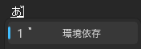

「あ゙」や「濁゙点゙な゙ん゙よ゙」のように、普通は濁点がつかない文字にも濁点をつける方法です。

Windowsの日本語入力では、文字の後ろに `3099` と入力して **F5キー**を押すと、Unicodeの濁点（結合文字）へ変換できます。

## 入力方法

例として「あ」に濁点をつけます。

1. 日本語入力をオンにして「あ」と入力する
2. 変換・確定せず、続けて `3099` と入力する
3. 入力中のまま **F5キー**を押す

入力途中は「あ３０９９」のように表示されます。

*「あ」に続けて3099と入力。まだ確定しません。*

そのままF5キーを押すと、`3099` が濁点に変換されて「あ゙」になります。

*F5キーを押すと「あ゙」に変換されます。*

## 複数の文字につける

濁点をつけたい文字ごとに、同じ操作を繰り返します。

*それぞれの文字に濁点をつけた例*

たとえば、次のような文字も入力できます。

> 濁゙点゙な゙ん゙よ゙

> ゆ゙る゙じでぇ゙ぇ゙ぇ゙ぇ゙ぇ゙ぇ゙

## うまくいかないとき

- `3099`を入力したあと、Enterキーやスペースキーで確定せずにF5キーを押してください。
- ノートPCでは、機種によって **Fn + F5** を押す必要があります。
- アプリやフォントによっては、濁点の位置がずれたり正しく表示されなかったりします。
- F5でページが再読み込みされる場合は、日本語入力がオンで、文字が入力中の状態になっているか確認してください。

## 仕組み

`3099` は、Unicodeの「結合用濁点（COMBINING KATAKANA-HIRAGANA VOICED SOUND MARK）」のコードです。F5キーでUnicodeコードから文字へ変換し、直前の文字と組み合わせて表示しています。

普段は濁点がつかない文字にも使えるので、ちょっと変わった文章を作りたいときに便利です。
