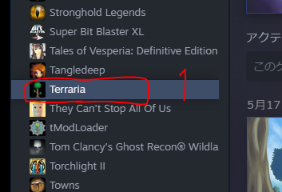
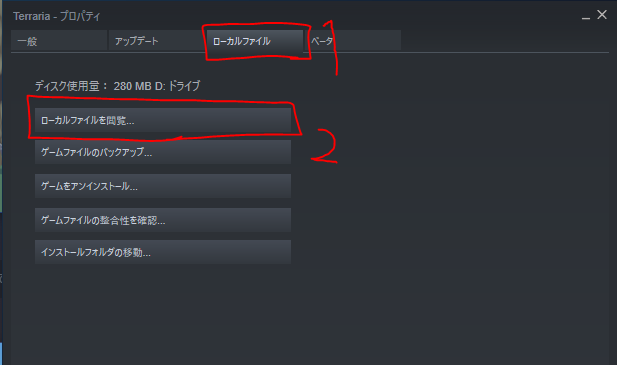
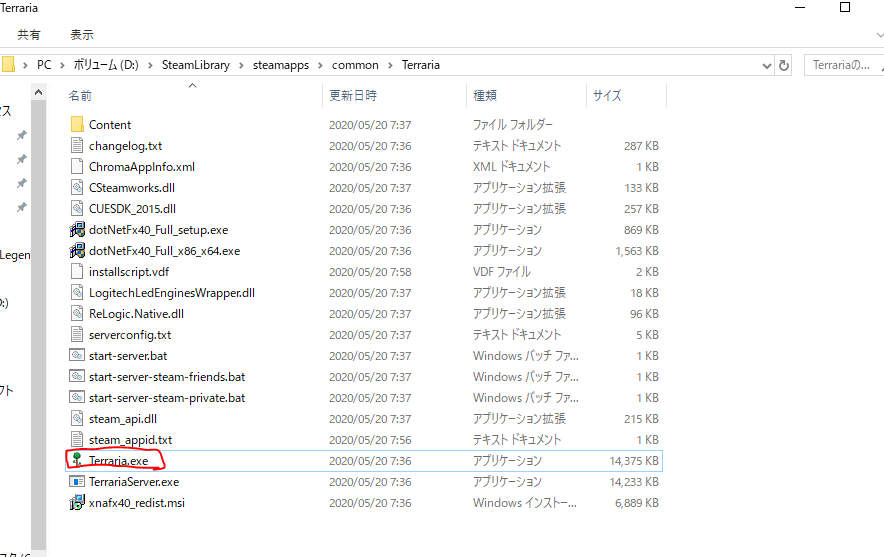
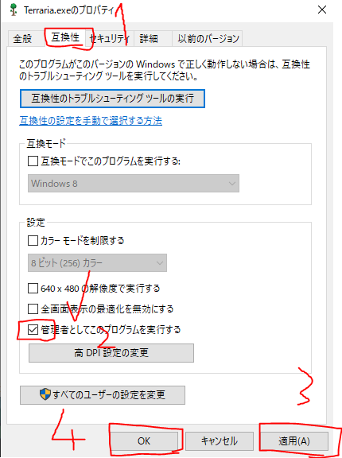
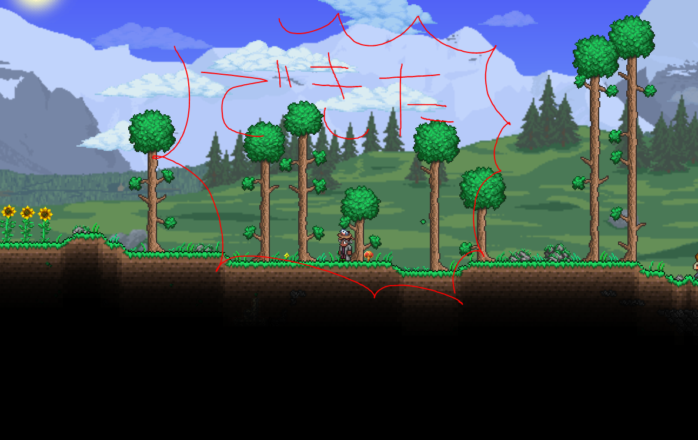

Terraria の最終アップデートバージョン **1.4（Journey's End）** が配信されましたね。
400時間以上プレイしているぼくも歓喜しました。

しかし、起動していざワールドに飛び込むと……

**動けない。移動できない。キーボードを同時押しするとなぜか動く？**

という謎の不具合に見舞われる方がいるそうです（ぼく）。
今回はこの問題を解決する方法を紹介します。

<div class="note-box">
✅ この記事の初出は2020年5月（1.4 配信直後）です。手順のスクリーンショットは当時の画面ですが、対処法そのものは現在も有効です。Steam のライブラリ UI が変更された箇所については本文中で補足しています。
</div>

## 原因：権限不足でキー入力が拾えていない

Terraria が管理者権限で動いていないと、他のソフト（常駐アプリやオーバーレイ）が握っているキー入力を
ゲーム側が受け取れないことがあります。
**Terraria.exe を管理者として実行する**設定にすれば解決します。

## 手順1: Terraria のローカルファイルを開く

まず、Steam のゲームライブラリにある Terraria を右クリックして「プロパティ」を開きます。



プロパティを開いたら「ローカルファイル」タブをクリックし、「ローカルファイルを閲覧...」をクリックして
`Terraria.exe` の入ったフォルダを開きます。



> **現在の Steam では名称が変わっています。**
> ライブラリ UI の刷新により、「ローカルファイル」タブは **「インストール済みファイル」**、
> ボタンは **「参照」** という名前になりました。やることは同じです。

## 手順2: 管理者として実行する設定

Terraria のフォルダが開いたら、`Terraria.exe` を右クリックして「プロパティ」を開きます。



プロパティを開いたら「互換性」タブを開いて、設定の
**「管理者としてこのプログラムを実行する」にチェック**を入れます。
その後「適用」を押して「OK」を押します。



以上で、冒頭の問題は解決されると思います。

## 手順3: 動作確認を行う

Terraria を起動して、動作が正常になっているか確認してみましょう。

なお、起動時に「この不明な発行元からの...」というユーザーアカウント制御のポップアップが出ますが、
「はい」を押すとゲームが起動します。



これでテラリア生活の始まりです。今まで以上に楽しみですね！

## それでも直らない場合の別アプローチ

管理者実行で直らないケースもあるので、あわせて試せる方法を挙げておきます。

### フルスクリーンを切り替えてからキー設定する

キー設定画面で入力を受け付けない場合、`Alt` + `Enter` でフルスクリーンとウィンドウを切り替えてから
設定すると、正常に変更できることがあります。

### 設定ファイルを直接編集する

キーコンフィグが壊れてしまった場合は、設定ファイルを直接書き換える手もあります。

```
C:\Users\<ユーザー名>\Documents\My Games\Terraria\input profiles.json
```

このファイルを削除するかリネームすると、次回起動時に初期状態のキー設定で作り直されます。
編集する場合は、必ずバックアップを取ってから行ってください。

### 常駐ソフトを疑う

キー入力を横取りする常駐ソフト（配信ソフトのホットキー、ゲーミングマウス/キーボードのユーティリティ、
オーバーレイ機能など）が原因のこともあります。
一度すべて終了した状態で起動して切り分けてみてください。
