2021年7月28日に Steam・PlayStation ストアでリリースされた **Tribes of Midgard** を約26時間プレイし、
全職業の解放を行い、最終ボス（サーガボス）を討伐して無事脱出することができたので、
ゲームの紹介とともにレビューしていきたいと思います。

紹介の中にはネタバレ要素が含まれているので注意！（できるだけネタバレしないようにします）

✅ この記事は<strong>2021年8月、シーズン1「狼のサーガ」時点</strong>のレビューです。本作はその後もシーズン制でコンテンツが追加されているため、職業数やモードなど現在の内容とは異なる場合があります。

## 概要

ある日突然、世界の終焉をもたらさんとする「邪悪な精霊」「悪魔の従者」「巨大な化け物」の猛襲から
小さな村を守り抜き、諸悪の根源を討伐して世界から脱出する——
アクション、タワーディフェンス、ローグライク、ハクスラ + etc の要素をうまーく融合させたゲームです。

最大10人でマルチプレイが可能であり、村の拡張や素材の収集、魔物の討伐などの役割分担ができます。
ソロプレイやモンスター討伐が苦手な方でもプレイしやすいように作られているので、気軽にプレイできます。

## サーガモード

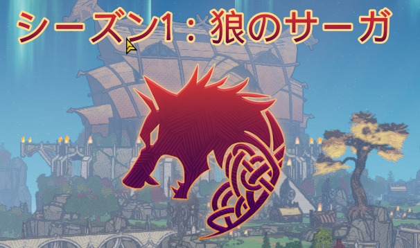

Tribes of Midgard のゲームモードは、**サーガモード**と**サバイバルモード**の二つに分かれています。
今回は「シーズン1：狼のサーガ」のサーガモードをゆっくり紹介していきます。

### サーガモードをプレイする

このゲームモードの主な目標は、**サーガボスを討伐し、この世界から脱出すること**です。
ゲームの進行は、画面左側に表示されているクエストを消化することで進んでいきます。

Tribes of Midgard の世界には**時間の概念**があり、制限時間以内にクエストをクリアしたり、
モンスターを討伐して素材を集めたりして、一日を最大限に活用することが
ゲームをうまく進めていくために重要になっていきます。

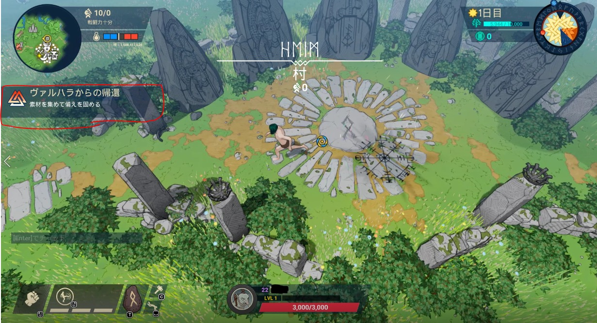

## 戦闘力・温度センサー・マップ

画面左上がミニマップ、右に戦闘力／必要戦闘力、温度センサーです。

戦闘力が不足していると、大型の敵にすぐダウンさせられてしまいます。
高難易度の地域に入る際は、防具やレベル、武器をアップグレードしてから挑みましょう。

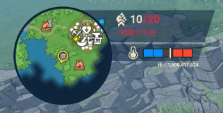

初期の半裸では、下の画像のように弱く……

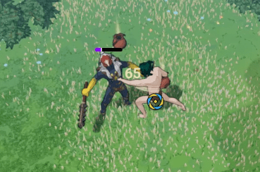

簡単な武器・防具を製作して装備するだけで、効率が大幅にアップします。

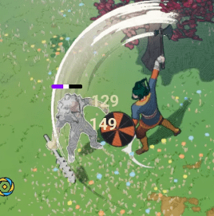

また、戦闘力（装備）が低くても、**仲間と共闘すれば勝てない敵にも勝る DPS** が出るので、
同じ世界にいるプレイヤーか友達を引き連れて戦うと良いです（友達は買えません）。

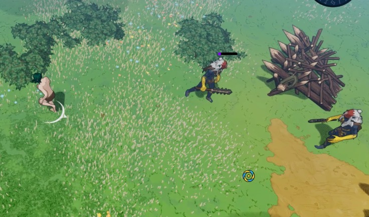

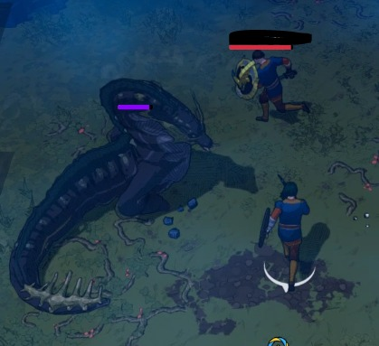

マップは下の画像のようになっていて、プレイヤー（他プレイヤーも含む）が未開の地に足を入れると
徐々に解放される仕組みになっています。
村には解放された祠にテレポートできる装置があり、各地に設置された祠を解放することで移動をショートカットできます。

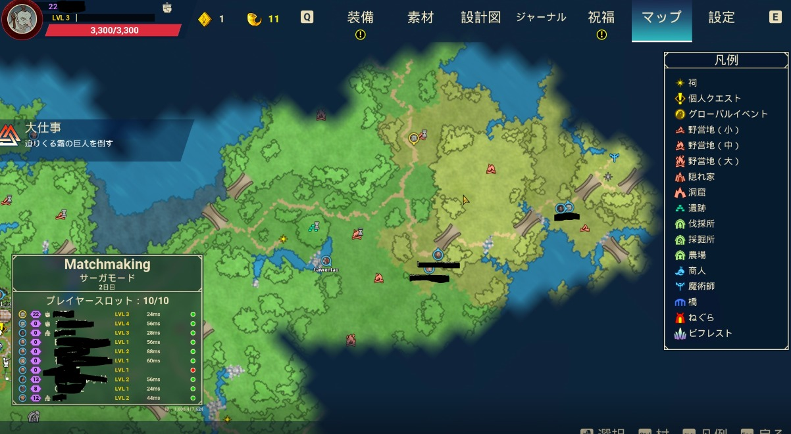

## 時間・ソウル

画面右上に現在の日にちと時間、水色のバーが拠点の残り耐久力、
その下に建設やアイテムの購入に使う**ソウルポイント**が表示されます。

下の画像で「50」と表示されているのがソウルポイントで、建築やアイテムの購入等に使います。
**死んでしまうとソウルポイントがすべて消えてしまう**ので注意です。
近くに味方がいる場合は、死亡する前に起こしてもらいましょう。

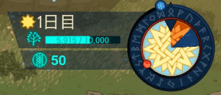

丸い時計のようなものの秒針（上の逆三角形）が黒にたどりつくと**夜**になり、
モンスターが村を襲いにくるので、速やかに村に戻って防衛しましょう。
村にいる住民たちも、村を守るために魔物の殲滅を手伝ってくれます。

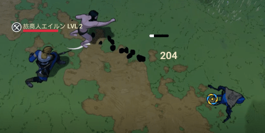

## スキル・建設・職業

画面左下では、装備している武器、スキル、建築等の現在の状況を確認できます。

下の画像では素手ですが、すぐ右にある蹴りのアイコンがスキルで、
アイコン下のスタミナゲージがあれば右クリックで敵を蹴り飛ばすことができます。
スキルは武器それぞれに設定されているので、自分の好みに合った武器を見つけましょう。

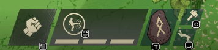

職業は現在8種類あり、初期では2つの職業（レンジャー、ウォリアー）が選択できます。
レベルが2になると各職業を選ぶことができます。

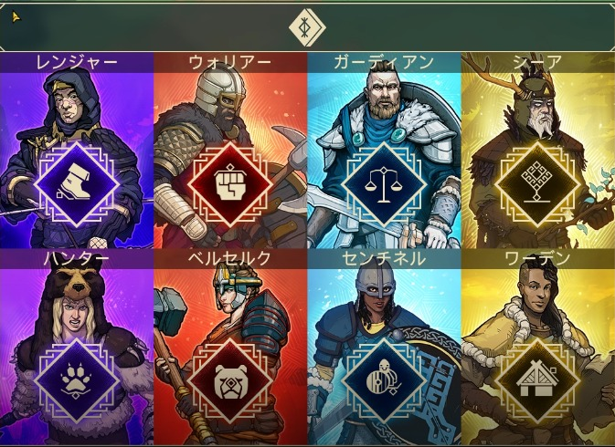

職業には、戦闘に強いクラスや探索に長けたクラス、仲間を守るためのクラス、建設特化クラスなど、
様々なプレイスタイルに対応したものがあります。

下の画像は**ウォリアー**のスキルツリー画面です。
得意武器は片手剣と片手斧。武器攻撃力増加や属性ダメージ増加などのパッシブスキルの他、
自己蘇生や装備耐久力の増加等の生存スキルを持った、戦闘寄りのバランス型クラスです。
少し戦闘力が足りなくても、大型の敵に対して攻撃力項目を上げておけば、
ポーションがぶ飲み・通常とスキルのゴリ押しで倒せてしまう、新参者にオススメのクラスです。

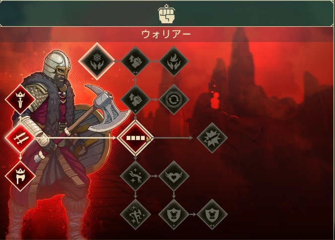

職業は、ある特定の実績を解除することによって取得できます。
職業解放はゲームを楽しむために非常に重要になっていきますので、積極的に開放していきましょう！

建設は、村の周りの防壁近くに弓兵の塔や壁を建設・アップグレードできるので、
魔物が襲来してくる夜の前に強化しておくといいかもしれません。

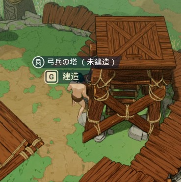

また、製作したり宝箱等から入手した建築素材で好きな場所に床を建設したりできるようですが、
今のところ段差をのぼるために使う以外の用途は無いように思えます。
今後のアップデートやサバイバルモード等で活躍する可能性あり？？

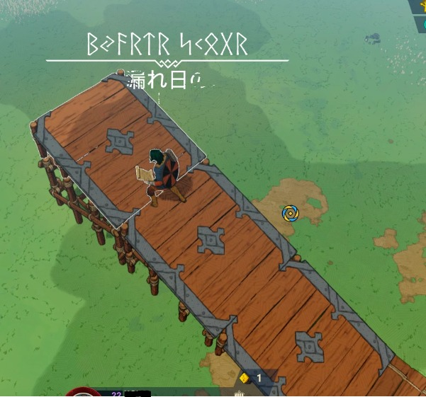

## まとめ・感想

プレイしてみて、ゲームを始めて2回目までは4日目に来る大型の魔物に村が破壊されてしまい非常に苦戦しましたが、
試行錯誤を重ねたりゲーム理解を深めることによって適切な時間管理ができるようになり、
**6回目でやっとサーガボスを討伐し、ゲームクリア**に至りました。

やればやるほどプロフィールレベルが上がって職業が解放されたり、製作できる武器が増えたりして、
より一層ゲームプレイの幅が広がっていく**スルメゲー**であると感じました。

今回紹介した内容以外にも、ボスの紹介や温度管理の焚き火などまだまだ楽しい要素があり紹介しきれていませんが、
非常にゲーム内容が濃く、一回のゲームでクリアまでにかかる時間は平均約2〜3時間です。

途中でセーブして別の日にプレイすることも可能ですが、
是非**1プレイ1クリア**を目指してみてはどうでしょうか！

> 久々に新鮮な気持ちでプレイできるゲームに会えました。効率を求めてプレイするのが楽しいです。
