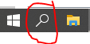
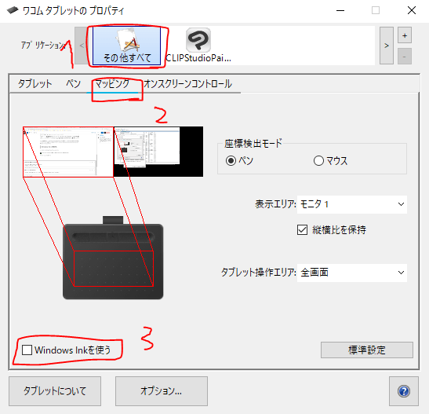

ワコム（Wacom）などのペンタブレットを購入して文字入力を行おうとしたところ、
**ペンタブで入力する手書きパネルが出てきて非常に目障り**。
無効にしたいと思って「ペンタブ 入力機能 いらない」と検索し、
サービスの **"Touch Keyboard and Handwriting Panel Service"** を無効にしたりしていませんか？

今回は、このサービスを無効にした場合に起こる現象と、
ペンタブの入力機能（Windows Ink）を無効にする**正しい方法**を紹介します。

⚠️ この記事の初出は2021年2月です。<strong>結論から言うと、このサービスは止めてはいけません。</strong>マイクロソフトも2020年10月に公式ブログで注意喚起しています。Windows 11 での現在の手順もあわせて追記しました。

## Touch Keyboard and Handwriting Panel Service を無効にすると起こること

### Microsoft IME が無効になる

キーボード入力に必要な Microsoft IME がブラウザやアプリで日本語入力を受け付けなくなり、
**アルファベットでしか入力できなくなります**。

ブラウザ等を開いた状態でタスクバー右下の IME アイコンにカーソルを合わせてみると、
「Microsoft IME が無効」と表示されているはずです。

このサービスは名前こそ「タッチキーボードと手書きパネル」ですが、実際には
**日本語 IME・絵文字パネル・クリップボード履歴・音声入力**といった入力機能全般を管理しています。
止めると、それらがまとめて巻き添えになります。

### 肝心の Windows Ink は有効のまま

そして最悪なことに、**無効にしたかったはずのペンタブの入力機能は有効のまま**です。
サービスを止めても目的は達成できません。

## 手順1: Touch Keyboard and Handwriting Panel Service を元に戻す

まずは無効にしてしまったサービスを戻して、IME を復活させます。無効にする方法の逆を行えば解決します。

1. タスクバーの検索マークをクリックして、「**コントロールパネル**」と入力して開く

   

2. コントロールパネルを開いたら「**システムとセキュリティ**」→「**管理ツール**」をクリック
3. 「**サービス**」を開き、サービス（ローカル）であることを確認してから、
   `Touch Keyboard and Handwriting Panel Service` を**右クリックしてプロパティ**を開く
4. 「全般」タブの「**スタートアップの種類**」を「**無効**」から「**自動**」に変更する
5. PC を再起動し、ブラウザを起動して日本語が入力できることを確認する

> **もっと早い開き方**：`Win` + `R` を押して `services.msc` と入力すれば、サービス画面を直接開けます。
> また Windows 11 では「管理ツール」は **「Windows ツール」** という名前に変わっています。

### Windows 11 ではそもそも無効にできません

Windows 11 ではこのサービスは **「Text Input Management Service」** に改名され、
**無効に設定できなくなりました**。マイクロソフト自身が「止めると壊れる」と判断した結果です。

Windows 11 を使っていて日本語入力がおかしい場合は、このサービス以外の原因を疑ってください。

## 手順2: Windows Ink を正しく無効化する

目的だった「ペンタブの入力機能を消す」は、**ワコムのドライバ側の設定**で行います。
サービスは一切触りません。

1. タスクバー右下にあるワコムタブレットのアイコンをクリックしてプロパティを開く

   

2. 「アプリケーション」で「**その他すべて**」を選択し、下の「**マッピング**」を開く
3. 「**Windows Ink を使う**」のチェックを外す

設定後、文字入力の際に Windows Ink（手書きパネル）が出てこなくなっているか確認してください。
消えていれば問題解決です。

> **現在のワコム製ドライバでは**、設定アプリが「**ワコム タブレットのプロパティ**」または
> 「**Wacom Center**」という名前になっています。項目名は同じ「Windows Ink を使う」です。

## 補足: Windows の設定側からも切れます

ドライバ側に項目が見つからない場合は、Windows の設定からも変更できます。

- **Windows 11**: 設定 → Bluetooth とデバイス → **ペンと Windows Ink**
- **Windows 10**: 設定 → デバイス → **ペンと Windows Ink**

ここで手書き入力パネルの表示や、ペン使用時のタッチキーボード表示を切り替えられます。

## まとめ

- `Touch Keyboard and Handwriting Panel Service` は**止めない**。止めると日本語入力が死ぬ
- Windows 11 では改名（Text Input Management Service）され、そもそも無効にできない
- Windows Ink を切りたいなら、**ワコムのドライバ設定か Windows の「ペンと Windows Ink」**から行う

ペンタブレットを導入したら、不必要な機能は正しい場所から無効にしておきましょう。
